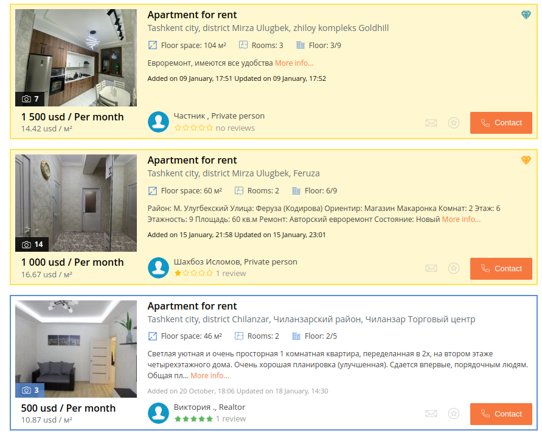
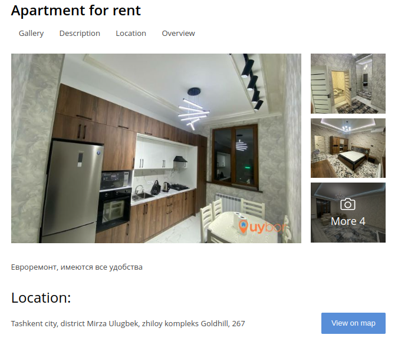

# Apartment Renting Website

This project is the copy of one popular website for apartment searching app. 
I tried to implement the main overview page, where the apartments in the database is represented as a list. 

Picture below: 

When pressed to each list the detailed pages gives more information of each apartment.

This is to practice what is just learnt from the Udemy course [Jonas Node.JS Bootcamp](https://www.udemy.com/course/nodejs-express-mongodb-bootcamp/). Alternative for [Node-Farm ](https://github.com/jonasschmedtmann/complete-node-bootcamp/tree/master/1-node-farm)exercise. 

## Objectives 
- learn Node.js 
- practicing front-end development 
- building and using simple APIs to make dataBase of apartments
- using HTML templates for the project 
- having fun